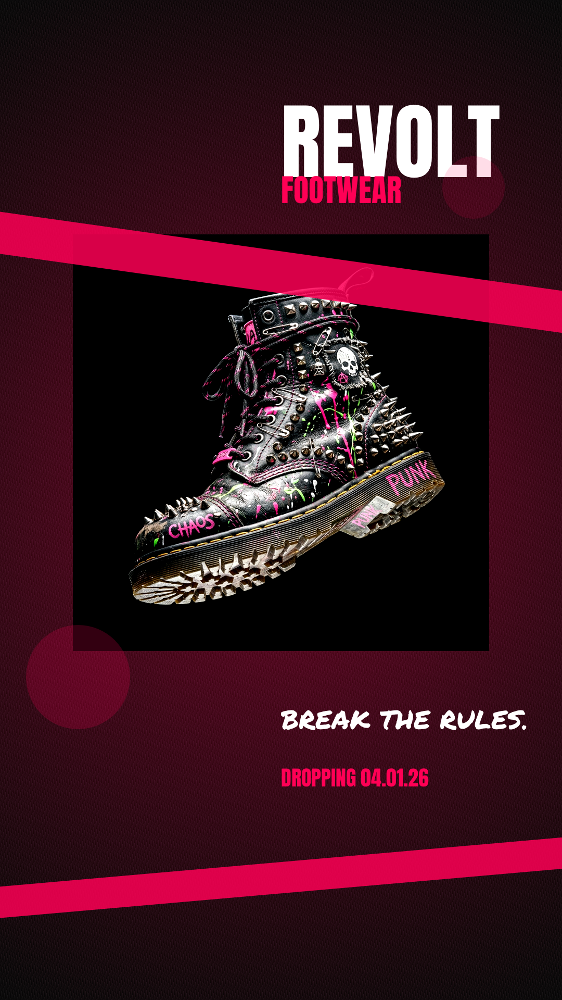
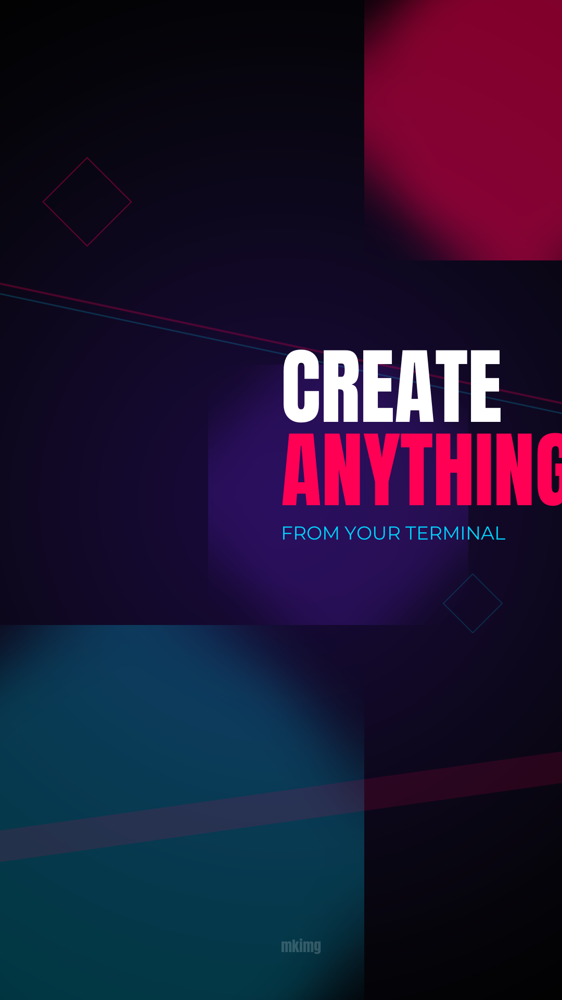

# mkimg

**Canva for your AI agent.**

A command-line image editor for creating ad creatives, social media graphics, and visual content. Compose layers, apply filters, generate images with AI, pull in Google Fonts and icon libraries — all from your terminal.

mkimg ships with a **skill file** that lets AI coding agents — [Claude Code](https://claude.com/claude-code), [OpenClaw](https://github.com/jwvictor/openclaw), and any agent that supports skills — drive it autonomously. Tell your agent "make me an Instagram story for a summer sale" and it knows every command, flag, and workflow.

## Examples

<p align="center">
  
  &nbsp;&nbsp;&nbsp;&nbsp;
  
</p>

<p align="center">
  <em>Left: AI-generated product ad with 9 layers, filters, and custom fonts. Right: Neon promo with blurred glows, geometric accents, and bold typography — 13 layers, no AI needed.</em>
</p>

Both created entirely from the command line with mkimg.

## Install

```bash
go install github.com/jwvictor/mkimg@latest
```

Or build and install everything (binary + AI agent skill) from source:

```bash
git clone https://github.com/jwvictor/mkimg.git
cd mkimg
./install.sh
```

This builds the binary to `/usr/local/bin/mkimg` and installs the skill file to `~/.claude/skills/mkimg/` so Claude Code and compatible agents can use it immediately.

To install just the binary without the skill:

```bash
go build -o mkimg .
sudo install -m 755 mkimg /usr/local/bin/mkimg
```

## Quick Start

### Use it yourself

```bash
# Create a project from a preset
mkimg new summer-sale --preset instagram-story --bg "#1a1a2e"

# Build up layers
mkimg layer add gradient --from "#e94560" --to "#f5a623" --angle 160
mkimg font install Anton
mkimg layer add text --content "SUMMER SALE" --font Anton --size 120 \
  --color "#ffffff" --align center --x 540 --y 400
mkimg layer add shape --shape circle --fill "#ffffff22" \
  --width 300 --height 300 --x 390 --y 800

# Apply effects
mkimg filter <gradient-id> vignette --strength 0.5

# Render
mkimg render -o summer-sale.png --open
```

### Let an AI agent do it

Once the skill is installed, just ask in natural language:

```
> make me a punk rock shoe ad for instagram stories, hot pink on black
```

The agent reads `~/.claude/skills/mkimg/SKILL.md`, understands every command and flag, and runs the full workflow — project creation, layers, fonts, AI generation, filters, render — without you touching a single flag.

Works with [Claude Code](https://claude.com/claude-code), [OpenClaw](https://github.com/jwvictor/openclaw), and any AI coding agent that supports skill files.

## How It Works

mkimg uses a declarative JSON project format (`_mkimg.json`). Each project has a canvas (dimensions + background color) and an ordered stack of compositable layers. Commands auto-detect the project file in your working directory.

### Layer Types

| Type | Description |
|------|-------------|
| `solid` | Solid color fill |
| `image` | Image file (cover/contain/fill/none) |
| `text` | Text with font, size, color, alignment, shadow, wrapping |
| `shape` | Rectangles, circles, ellipses, lines with fill/stroke |
| `gradient` | Linear, radial, or conic gradients with color stops |
| `ai` | AI-generated image from a text prompt |
| `icon` | Material Design or Font Awesome icons |

Every layer supports positioning (`--x`, `--y`), sizing (`--width`, `--height`), `--opacity`, and `--rotation`.

### Filters

18 filters available: `blur`, `sharpen`, `brightness`, `contrast`, `saturation`, `gamma`, `hue`, `grayscale`, `sepia`, `invert`, `duotone`, `pixelate`, `vignette`, `noise`, `posterize`, `emboss`, `edge`, `glow`.

```bash
mkimg filter <layer-id> blur --radius 5
mkimg filter <layer-id> sepia
mkimg filters                          # list all with params
mkimg unfilter <layer-id> [type]       # remove filters
```

### Presets

20 built-in canvas templates for common formats:

```bash
mkimg presets                          # list all
mkimg new banner --preset youtube-thumbnail
mkimg new story --preset instagram-story
```

### Fonts

Search, install, and use any Google Font:

```bash
mkimg font search "Anton"
mkimg font install Anton
mkimg font list
```

### Icons

Material Design Symbols and Font Awesome Free:

```bash
mkimg icon install material
mkimg icon install fontawesome
mkimg icon search "heart"
mkimg layer add icon --icon-name heart --collection material --size 48 --color "#ff0000"
```

### AI Image Generation

Generate images with Google Gemini:

```bash
# Standalone
mkimg generate --prompt "a sleek product photo on marble" -o product.png

# As a project layer
mkimg layer add ai --prompt "minimalist product photo on white background"
```

Requires `GEMINI_API_KEY` or `GOOGLE_API_KEY` environment variable.

## Commands

```
mkimg new <name>                   Create a new project
mkimg presets                      List canvas presets
mkimg info                         Show project details
mkimg dump                         Print raw project JSON
mkimg resize                       Resize the canvas

mkimg layer add <type> [flags]     Add a layer
mkimg layer list                   List layers
mkimg layer edit <id> [flags]      Edit a layer
mkimg layer move <id> <pos>        Reorder a layer
mkimg layer remove <id>            Remove a layer
mkimg layer toggle <id>            Show/hide a layer
mkimg layer duplicate <id>         Clone a layer

mkimg render [-o file] [--open]    Render to PNG/JPEG
mkimg preview                      Render and open

mkimg filter <id> <type> [flags]   Apply a filter
mkimg filters                      List available filters
mkimg unfilter <id> [type]         Remove filters

mkimg font search/install/list     Manage Google Fonts
mkimg icon install/search/list     Manage icon libraries
mkimg generate --prompt <text>     Standalone AI generation
```

## AI Agent Skill

mkimg includes a skill file (`skill/SKILL.md`) that teaches AI coding agents how to use every command, flag, and workflow. When installed to `~/.claude/skills/mkimg/`, agents like Claude Code and OpenClaw automatically pick it up.

The skill file covers:
- All CLI commands with full flag documentation
- Layer types and their required/optional parameters
- Filter types and parameter ranges
- The project lifecycle (new, layer, filter, render)
- External integrations (Gemini, Google Fonts, icon libraries)
- Cache structure and environment variables

To install or update the skill separately:

```bash
mkdir -p ~/.claude/skills/mkimg
cp skill/SKILL.md ~/.claude/skills/mkimg/SKILL.md
```

To uninstall everything:

```bash
./uninstall.sh
```

## Local Cache

Fonts and icons are cached in `~/.mkimg/`:

```
~/.mkimg/
├── fonts/<family>/*.ttf
└── icons/
    ├── material/
    └── fontawesome/
```

## License

BSD 3-Clause. See [LICENSE](LICENSE).
